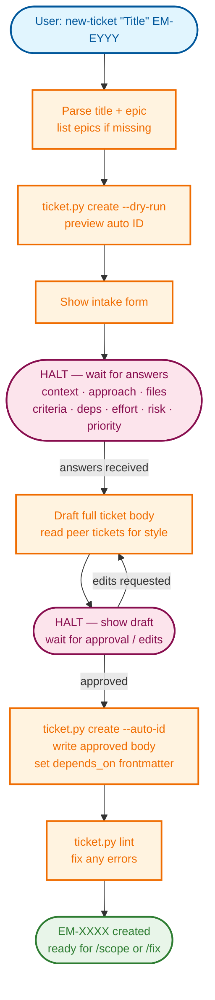

# New Ticket

Draft and create a complete CleanPaste Lite ticket from a description. This skill
produces a fully-formed engineering ticket ready for `/scope` and `/fix`, not a stub.



## Quick start

1. Parse the title and epic from the argument. If either is missing, list epics and ask.
2. Preview the auto-assigned ID with a dry-run.
3. Show the **intake form** and HALT for user input.
4. Draft the full ticket body.
5. HALT for user approval.
6. Create with the hygiene tool, write the body, set `depends_on` in frontmatter if provided.
7. Run lint.
8. Report the created file path.

---

## Step 0 — Argument parsing

Accept arguments in any of these forms (all equivalent):

- `new-ticket "Title" EM-EYYY`
- `new-ticket "Title" --epic EM-EYYY`
- `new-ticket EM-EYYY "Title"`
- `new-ticket` (both missing — ask)

**Both a title and an epic are required.** If either is missing, list available epics:

```bash
ls tickets/ | grep EM-E
```

Print the epic list with the directory name as context. Then ask for whichever
is missing and stop until you receive it.

---

## Step 1 — Preview the assigned ID

Run a dry-run to preview the ticket ID:

```bash
python scripts/ticket_hygiene/ticket.py create --auto-id --dry-run "<Title>" --epic EM-EYYY
```

Note the assigned ID. If the title contains special characters, single-quote it
in the shell command.

If the command fails (non-zero exit, unknown epic, etc.), stop and report the error. Do not proceed to the intake form until the epic is valid and the dry-run succeeds.

---

## Step 2 — Intake form (one HALT)

Output the intake form below verbatim. Substitute the real ID, title, and epic.
Do not reorder fields or add preamble.

```
New ticket: <EM-XXXX> — "<Title>"
Epic: <EM-EYYY>

Answer each section. Use "-" to leave a section minimal.

  1. Context
     What problem, gap, or need does this ticket address?
     >

  2. Approach
     How should it be solved or built? Rough direction is fine.
     >

  3. Files to touch
     Which files will change? A rough list is OK.
     >

  4. Acceptance criteria
     List the key "done" checks (one per line).
     >

  5. Dependencies
     Ticket IDs this blocks on (e.g. EM-1234 EM-1235), or "none".
     >

  6. Effort  [default: 2h | options: 30m 1h 2h 4h 1d 2d 3d 1w]
     >

  7. Risk    [default: LOW | options: LOW  MEDIUM  HIGH]
     >

  8. Priority  [default: 3 | options: 1 (highest) → 5 (lowest)]
     >
```

**HALT.** Do not draft or create anything until the user answers. If the user
answers only some fields, ask for the missing mandatory ones (1–5) before continuing.
Fields 1–5 are required (type 'none' for dependencies if there are none). Fields 6–8 may be omitted to use the defaults.

---

## Step 3 — Draft the ticket body

Using the intake answers, write the full ticket body. Read two or three tickets
in the same epic as style references before drafting.

**Standard section structure:**

```markdown
# <EM-XXXX> — <Title>

**Epic:** <EM-EYYY> — <Epic Name>
**Risk:** <emoji> <LEVEL> — <one-sentence risk framing>

---

## Context

<2–4 sentences expanding the user's context answer. Name the specific gap,
broken invariant, or missing capability. Reference the relevant module or layer
where it helps.>

---

## Approach

<Expand the user's approach answer. For architectural choices, include a brief
"Option considered and rejected" paragraph when relevant, followed by the chosen
approach with a short justification. For straightforward fixes, 3–5 sentences
suffice. Include code sketches only when they clarify a non-obvious interface.>

---

## Files Touched

<List from the user's input:>
- `path/to/file.py` — what changes

---

## Tests

<2–4 concrete test sketches, derived from the approach and acceptance criteria.
Name the function and the assertion, not just "add tests".>

---

## Acceptance Criteria

<Convert the user's criteria into checkboxes. Add 1–2 implied checks
(e.g. lint passes, tests green) only if they are genuinely non-obvious.>
- [ ] ...

---

## Effort

<effort> — <one-line sub-task breakdown only if effort ≥ 1d>
```

**Drafting rules:**
- Risk emoji: 🟢 LOW · 🟡 MEDIUM · 🔴 HIGH
- Do not invent requirements the user did not mention.
- Expand intake answers into proper prose; do not paste them verbatim.
- If the approach is unclear, mark it with `**Open question:** ...` in the
  Approach section rather than guessing.
- Keep acceptance criteria checkboxes concrete and verifiable.
- Omit a section entirely if the user answered "-" and it has nothing to say.

Post the full draft in chat, then output:

```
Draft above. Say "create" (or "go") to create the ticket, or give me corrections first.
```

**HALT.** If the user requests edits, apply them and re-post the updated draft
before proceeding.

---

## Step 4 — Create the ticket

After the user approves (any of: "create", "go", "proceed", "ship it", "looks good",
"yes", or equivalent):

**4a. Create the stub:**

```bash
python scripts/ticket_hygiene/ticket.py create --auto-id "<Title>" --epic EM-EYYY \
  --effort <value> --risk <LEVEL> --priority <N>
```

Use the exact defaults (2h / LOW / 3) if the user did not override them. Verify
the command exits 0 before continuing.

**4b. Find the created file:**

```bash
python scripts/ticket_hygiene/ticket.py find <EM-XXXX>
```

**4c. Open the file.** The hygiene tool writes frontmatter + a minimal body stub.
Replace the body (everything after the closing `---` of the frontmatter) with
the full approved draft.

**4d. Set `depends_on` in frontmatter.** If the user provided dependency IDs in
field 5, open the file and update the `depends_on:` line in the frontmatter from
`[]` to `[EM-XXXX, EM-YYYY, ...]`. Do this with an Edit, not a shell sed command.

**4e. Run lint:**

```bash
python scripts/ticket_hygiene/ticket.py lint
```

Fix any errors before reporting done.

---

## Step 5 — Report

Output exactly (substitute real values):

```
<EM-XXXX> created: tickets/<epic>/open/<filename>.md

<One sentence: what the ticket is for and why it matters.>
```

Then **HALT**. Do not open the ticket, run scope, or start implementation.

---

## Non-negotiable rules

- Title and epic are mandatory. Do not create anything without both.
- The intake HALT must happen. Do not draft without user input.
- Do not invent requirements. Every section must be grounded in the intake answers.
- The draft HALT must happen. Do not call `ticket.py create` without explicit approval.
- After creation, lint must pass before reporting done.
- Do not start implementation. This skill creates the ticket only.
- If the draft changes materially during review, re-post it in full before creating.
- Rust-portability is a first-class constraint. Note it in the Approach section
  if the work touches Python code that will be ported.
