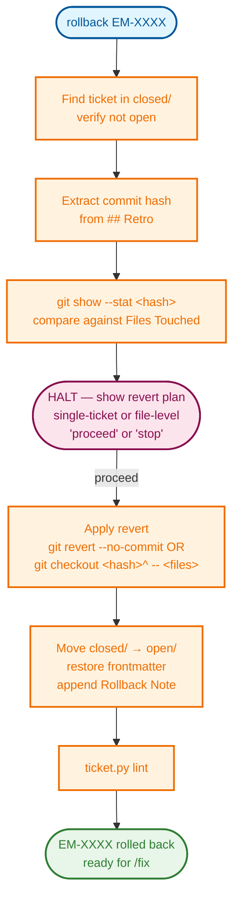

# Rollback

`rollback` safely reverts a ceremony commit for a ticket that introduced a regression.
It extracts the commit hash from the closed ticket's retro, shows exactly what changed,
guards against reverting multi-ticket commits, and reopens the ticket ready for
re-implementation.



---

## Step 0 — Argument guard

The ticket ID is mandatory. Accept:
- `rollback EM-XXXX`
- `rollback` (missing — ask and HALT until provided)

If the argument does not match `EM-NNNN` (or a known ticket ID pattern), output:

```
Ticket ID is required. Example: /rollback EM-2001
```

**HALT.**

---

## Step 1 — Locate the ticket in `closed/`

```bash
python scripts/ticket_hygiene/ticket.py find EM-XXXX
```

Read the returned path. Then:

- If not found at all:
  ```
  EM-XXXX not found. Check the ticket ID and try again.
  ```
  **HALT.**

- If the path is in `open/` (not `closed/`):
  ```
  EM-XXXX is still open at <path>.
  Rollback only applies to closed tickets. Use /fix EM-XXXX to re-implement.
  ```
  **HALT.**

- If the path is in `closed/`, continue.

---

## Step 2 — Extract the ceremony commit hash

Read the ticket file. Search the `## Retro` section for a line matching:

```
**Commit:** `<hash>`
```

The hash is the value inside the backticks (7–40 hex characters).

If no such line is found, output:

```
No commit hash found in EM-XXXX's retro.
The ceremony may have used --no-commit or the hash was not recorded.

To roll back manually:
  1. Identify the commit: git log --oneline -- tickets/<epic>/closed/<filename>
  2. Run: /rollback EM-XXXX  (after noting the hash is missing from the retro)
  3. Or revert manually with: git revert --no-commit <hash>

Halting — nothing changed.
```

**HALT.**

---

## Step 3 — Show commit contents

Run:

```bash
git show --stat <hash>
```

Print the output verbatim. If `git show` fails (unknown hash), output:

```
ERROR: git show failed for <hash>. The commit may have been squashed or force-pushed.
Halting — nothing changed.
```

**HALT.**

---

## Step 4 — Detect multi-ticket commit

Extract the list of changed files from `git show --stat` (lines ending in `| N +++/---`).
Extract the **Files Touched** list from the ticket's `## Files Touched` section (paths in backticks).

**If the ticket has no `## Files Touched` section**, treat the commit as single-ticket
and note the assumption:

```
Note: EM-XXXX has no Files Touched section — cannot verify commit scope.
Treating as single-ticket commit.
```

Otherwise, compare the two sets. A **multi-ticket commit** is detected when `git show --stat`
reports files that are NOT in the ticket's Files Touched list, and those extra files are not
trivially explained (e.g. the ticket file itself and the `TICKET_INDEX.md` may always appear).

Exclude from the "extra files" count:
- The ticket file itself (`tickets/<epic>/closed/<filename>.md`)
- `tickets/TICKET_INDEX.md`

If extra files remain after exclusions, it is a multi-ticket commit.

---

## Step 5 — HALT for approval

### Single-ticket commit (no extra files)

Output exactly:

```
Revert plan for EM-XXXX

Commit: <hash>
Type: single-ticket — safe for full revert

Will run:
  git revert --no-commit <hash>

After reverting, EM-XXXX will be moved back to open/ with a ## Rollback Note.
Run /fix EM-XXXX to re-implement.

Type "proceed" to apply the revert, or "stop" to cancel.
```

### Multi-ticket commit (extra files detected)

Output exactly:

```
⚠️  Multi-ticket commit detected for <hash>

Files in this commit NOT in EM-XXXX's Files Touched:
  - <extra file 1>
  - <extra file 2>

Full revert blocked — it would undo other tickets' work.

File-level revert (safe):
  git checkout <hash>^ -- <files from EM-XXXX Files Touched>

This restores only EM-XXXX's files to their state before the commit,
leaving all other files untouched.

Type "proceed" to apply the file-level revert, or "stop" to cancel.
```

**HALT.** Do not apply any git operation until the user types "proceed" (or "go", "yes", "do it").
On "stop" (or "cancel", "no", "abort"): output `Rollback cancelled — nothing changed.` and **HALT**.

---

## Step 6 — Apply the revert

### Single-ticket commit

```bash
git revert --no-commit <hash>
```

If this fails (e.g. conflicts), output the error and:

```
Revert had conflicts. Resolve manually with:
  git revert --no-commit <hash>
  # resolve conflicts
  git add <resolved files>

Then re-run /rollback EM-XXXX or proceed to Step 7 manually.
```

**HALT.**

### Multi-ticket commit (file-level revert)

For each file in the ticket's **Files Touched** that appears in `git show --stat`:

```bash
git checkout <hash>^ -- <file>
```

Run one command per file. If any file checkout fails, report the failure but continue with the remaining files.

---

## Step 7 — Reopen the ticket inline

Do not invoke `/reopen` — the note format and commit state differ. Perform the reopen directly following the shared mechanics:

**7a. Ask for a rollback reason** (one HALT):

```
Reason for rollback? (one line — e.g. "introduced regression in X")
```

**HALT.** Wait for the user's answer.

**7b–7c. Move the ticket file and restore frontmatter** per [references/reopen-mechanics.md](../../references/reopen-mechanics.md).

**7d. Append the Rollback Note** at the end of the file body (replaces the standard Reopen Note):

```markdown
## Rollback Note

**Rolled back:** <today's date YYYY-MM-DD>
**Commit reverted:** `<hash>`
**Reason:** <user's answer from 7a>
**Revert type:** full revert / file-level revert
```

Substitute the real values. Use "full revert" or "file-level revert" to match what was applied in Step 6.

---

## Step 8 — Lint

```bash
python scripts/ticket_hygiene/ticket.py lint
```

If lint reports errors for EM-XXXX, fix them before halting. Pre-existing errors in other tickets may be noted but not fixed here.

---

## Step 9 — Report and HALT

Output exactly:

```
EM-XXXX rolled back.
  Commit reverted: <hash>
  Ticket moved to: tickets/<epic>/open/<filename>

Run /fix EM-XXXX to re-implement.
```

**HALT.** Do not run scope, fix, or any other skill automatically.

---

## Acceptance test

To verify the skill against a real ceremony commit:

```bash
# 1. Pick a recently closed ticket that has a Commit: line in its retro
python scripts/ticket_hygiene/ticket.py open  # find any recently closed ticket
# or search directly:
grep -rl "Commit:" tickets/*/closed/*.md | head -3

# 2. Extract and verify the hash with the helper
python .agents/skills/rollback/scripts/extract_hash.py EM-XXXX
# Expected: prints a 7-40 char hex hash, exits 0

# 3. Verify the commit exists in git history
git show --stat <hash>
# Expected: shows the ceremony commit's file list

# 4. Check for multi-ticket detection (if testing that path):
#    Find a commit that touched both ticket files and code files
git log --oneline --all | head -20
git show --stat <hash-of-commit-all>

# 5. Verify non-closed ticket is rejected:
python .agents/skills/rollback/scripts/extract_hash.py EM-OPEN-TICKET
# Expected: "Ticket EM-XXXX is not in closed/", exits 1

# 6. Verify missing hash is rejected:
#    (pick a closed ticket without **Commit:** in its retro)
# Expected: "No commit hash found", exits 1
```

After a full skill run, verify:
- `git diff --staged` shows only the reverted changes (no unrelated files)
- `tickets/<epic>/open/<filename>.md` exists and has `## Rollback Note`
- `status: OPEN` in frontmatter, `closed:` field absent
- `ticket.py lint` passes

## Non-negotiable rules

- **Ticket ID is mandatory.** Do not proceed without it.
- **Only roll back tickets from `closed/`.** Ticket must be in `closed/`, not `open/`.
- **A commit hash must be present in the retro.** Do not guess or search git log.
- **Full revert is blocked for multi-ticket commits.** Offer file-level revert only.
- **User approval is required before any git operation.** The Step 5 HALT is mandatory.
- **Ask for a rollback reason before moving the file.** Step 7a HALT is mandatory.
- **Do not commit after reverting.** The reverted changes are left staged for the user to review and recommit as part of the new `/fix` cycle.
- **Do not auto-run `/fix` or `/scope` after reopening.** Output the reminder but do not invoke.
