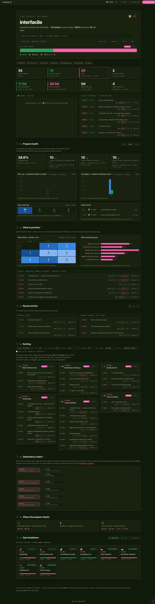

# interfacile 🧩

> One portable engine that turns a folder of markdown tickets into a live,
> themeable project-portfolio dashboard — many projects, one switchable hub.

[](LICENSE)
[](https://www.python.org/)


<p align="center">
  
</p>

interfacile scans a `tickets/` folder of markdown files and serves a **live**
dashboard — burn-up & throughput charts, a priority×risk matrix, a walkable
dependency graph, per-epic breakdowns, and every ticket rendered from its own
markdown. Standard-library Python, no build step: everything is computed on each
request, so you edit a ticket, refresh, and it's there.

**One engine, many interfaces.** A single install drives the dashboard for any
number of repos — each with its own id prefix, brand, theme, and keyboard
shortcut — switchable from **one hub** via a top-bar dropdown. Every project's
tickets stay in its own repo, and everything interfacile needs lives in one
hidden `.interfacile/` folder — a small `config.json` describes how the interface
looks, alongside the (git-ignored) scratchpad, to-do, and pin state.

> interfacile is built with interfacile — this repo tracks its own work in
> [`tickets/`](tickets/), so `cd interfacile && interfacile` shows the board
> pictured above.

## Features

- 📋 **Live markdown tickets** — one folder per epic, YAML front-matter, rendered
  and editable in place. No database, no build step.
- 📈 **Real dashboards** — burn-up, throughput, priority×risk matrix, effort
  remaining, dependency chains, per-epic breakdowns, health KPIs.
- 🛰️ **Multi-interface hub** — serve many repos from one process and switch
  between them with a dropdown or a **per-project keyboard shortcut**.
- 🎫 **A built-in ticket flow** — `new`, `tickets`, `ready`, `close`, `lint`
  straight from the CLI, plus agent skills (`new-ticket`, `work-ticket`,
  `close-ticket`, `ticket-status`) that `init` installs into your repo.
- 🎨 **14 theme presets + custom palettes** — each interface gets a distinctive
  background so you always know which project you're in. Light & dark automatic.
- 🧰 **Zero dependencies** — standard-library Python 3.8+, one command to install.
- 🔒 **Your data stays put** — tickets/scratchpad/todos live in each project's
  own repo; interfacile only reads them.

## Install

You run `interfacile` from *inside other repos*, so the command has to work from
**any** folder. That means getting it onto your `PATH` — do this **once, ever**.

**Step 1 — get the code.**

```bash
git clone https://github.com/aphoristicEpigram/interfacile
cd interfacile
```

**Step 2 — install it. Pick ONE route.**

*Route A — `pipx`* (cleanest, but only if you already have `pipx`):

```bash
pipx install .
```

*Route B — venv + symlink* (no extra tools needed; works on a stock Mac):

```bash
python3 -m venv venv
./venv/bin/pip install -e .
sudo ln -s "$PWD/venv/bin/interfacile" /usr/local/bin/interfacile
```

**Step 3 — prove it worked.** Move somewhere else on purpose, then run it:

```bash
cd ~
interfacile --version
```

A version number means you're done. `command not found` means Step 2 didn't take
— see **[Troubleshooting](#troubleshooting)**.

> ### The one trap ⚠️
>
> Running `pip install -e .` **with a venv active** installs `interfacile` into
> *that venv only*. Switch to another project (with its own venv) and the command
> vanishes:
>
> ```
> zsh: command not found: interfacile
> ```
>
> This is the single most likely way to get stuck, and it looks like a broken
> install when it isn't. Route B's `ln -s` is what prevents it: the symlink points
> at the venv's launcher script, which hard-codes its own Python in the shebang —
> so it runs correctly from any directory, with any venv active, or none at all.

Requires Python 3.8+. No runtime dependencies.

## Quick start — add a repo to the dashboard

> **Install interfacile first (above).** `interfacile init` is a command *you*
> run inside your project; it is not something your project provides. If it says
> `command not found`, you skipped the install.

**1. Go to the repo you want a dashboard for.**

```bash
cd /path/to/your-repo
```

**2. Set it up.**

```bash
interfacile init
```

That single command does everything:

- writes `.interfacile/config.json`
- **offers a wizard to create your first epics** (see below)
- installs the **ticket-flow skills** into `.claude/skills/` and a
  `tickets/README.md` process doc (skip with `--no-skills`)
- adds the `.gitignore` rules
- registers the repo with the hub

It is **safe to re-run** — an existing config, registration, and ignore rule are
all left alone.

The wizard just asks for a title per line, and an optional emoji after a `|`:

```
Create some epics now? [Y/n] y

  One epic per line, blank line when you're done.
  Format:  Title            (or)   Title | 🎭

  AA-E001  title> Character Development | 🎭
      ✓ created tickets/AA-E001-character-development/  🎭 Character Development
  AA-E002  title> Weekly Blogs | 📅
      ✓ created tickets/AA-E002-weekly-blogs/  📅 Weekly Blogs
  AA-E003  title>
```

Each epic gets a folder, `open/` and `closed/` bays, and a charter — and is
written into your config. Decline (or pass `--no-wizard`) and you get a starter
`tickets/` tree instead. It never prompts when stdin isn't a terminal, so it's
safe in scripts and CI.

Add more epics to a repo later with:

```bash
interfacile epics          # same wizard, continues the numbering
```

**3. Look at it.**

```bash
interfacile          # serves this repo, opens your browser
```

**4. Add it to your hub.**

```bash
interfacile hub
```

A hub that's already running picks the new repo up by itself — the registry is
re-read when it changes, so the switcher updates on your next refresh.

**5. Make it yours (optional).** Edit the generated `.interfacile/config.json` to
set the brand name, favicon, epics, theme, `shortcut` (give each repo a distinct
key), and `server.port` (give each repo a distinct port). See
[Configuring an interface](#configuring-an-interface).

Save the file and **refresh** — the config is re-read on change, so you don't
need to restart anything to see it.

### What `init` decides for you

`init` guesses the id prefix from existing tickets (e.g. `TH-0004` → `TH`),
otherwise from the folder name. It also appends these lines to the repo's
`.gitignore`, so the config is committed while the state the dashboard writes
(pins, scratchpad, to-do) stays local and private:

```gitignore
.interfacile/*
!.interfacile/config.json
```

**Just want to look around first?** Serve the bundled demo — no setup, no repo:

```bash
interfacile serve --repo examples     # a self-contained EX- demo board
```

## Run a hub (many projects, one switcher)

Register each repo once, then launch with no arguments:

```bash
interfacile register /path/to/repo-a
interfacile register /path/to/repo-b
interfacile list          # show registered interfaces
interfacile hub           # serve them all; switch with the dropdown or shortcut keys
```

Or pass them explicitly (flag order = switcher order):

```bash
interfacile hub --repo /path/to/repo-a --repo /path/to/repo-b
```

The registry lives at `~/.config/interfacile/registry.json`. The hub opens at a
tidy branded loopback URL like `http://interfacile.localhost:8788/` (plain
`http://localhost:8788/` works too). Give each repo a switcher key and you can
jump straight to it from anywhere in the hub:

```bash
interfacile shortcut 3        # press '3' anywhere in the hub to switch here
interfacile shortcut          # show the current key
interfacile shortcut --clear  # remove it
```

Setting a key warns if another registered repo already uses it, and
`interfacile list` shows every repo's key.

## Configuring an interface

A hidden `.interfacile/config.json` at a repo root controls that interface:

| Field | What it sets |
|---|---|
| `brand` | `name`, `favicon`, `icon`, `eyebrow`, `tagline` |
| `ids` | `prefix` (drives all id patterns) and `digits` |
| `epics` | per-epic titles + emoji |
| `links` | quick links in the header (`emoji`, `title`, `url`) |
| `theme` | a preset name, or a full custom palette |
| `shortcut` | a key that switches to this interface from anywhere |
| `server.port` | default port |

**Quick links** — add a `links` list to put your own buttons in the header, next
to the pin/scratchpad. Each is `{ "emoji", "title", "url" }`; add as many as you
want, in any order. `emoji` is optional (defaults to 🔗) and hovering a button
shows its `title`:

```json
"links": [
  { "emoji": "⚙️", "title": "Backend",         "url": "https://github.com/acme/api" },
  { "emoji": "🚀", "title": "Live application", "url": "https://app.acme.com" }
]
```

**Themes** — 14 built-in presets, each with its own background:
`blue`, `violet-neon`, `green`, `forest`, `teal`, `cyan`, `indigo`, `violet`,
`rose`, `crimson`, `orange`, `amber`, `lime`, `slate` — or supply your own
palette (a few semantic colours for light and dark). Full field reference and
worked examples: [`examples/configs/`](examples/configs/).

## Ticket format

Tickets are markdown with YAML front-matter; the body is free-form and rendered
when you open the ticket.

```yaml
---
id: TH-0003            # required — <PREFIX>-#### 
title: Streaming API   # required
epic: TH-E001          # groups the ticket under an epic
status: OPEN           # OPEN | CLOSED | WONT_FIX | STANDING
risk: MEDIUM           # HIGH | MEDIUM | LOW      → priority×risk matrix
priority: 2            # 1..N                     → matrix + backlog rank
effort: 2d             # 4h, 2d, 1-2d             → effort/burn-down
depends_on: [TH-0001]  # dependency graph edges
created: 2026-06-05
closed: 2026-06-20     # required when status is CLOSED
---
```

One folder per epic; the `open/` and `closed/` subfolders are for humans — a
ticket's real state is its `status:` field. See a live example under
[`examples/tickets/`](examples/tickets/).

## The ticket flow

You never hand-write ids, frontmatter, or filenames — the CLI owns them, and
everything is driven by your repo's config (no hardcoded prefixes anywhere):

```bash
interfacile new "Ship the widget" --epic E001   # next free id, right folder
interfacile tickets                             # the board, grouped by epic
interfacile ready                               # what can start now, P1 first
interfacile show  TK-0002                       # one ticket, path + contents
interfacile deps  TK-0002                       # what it waits on / what waits on it
interfacile close TK-0002 --note "shipped"      # status+dates+move, in one step
interfacile lint                                # ids, fields, dates, dep graph
```

Two ideas keep it simple: **"blocked" is never a status** — a ticket is blocked
while anything in its `depends_on` is still open, and unblocks itself when that
closes (`close` even tells you what it just unblocked); and **`lint` is the
referee** after any hand edit.

Changed your mind? `interfacile reopen ID` undoes a close, and
`interfacile drop ID --why "..."` records a deliberate WONT_FIX (which
unblocks dependants just like closing). For scripts, CI, and agents,
`tickets`, `ready`, `show`, and `lint` all take `--json`.

`interfacile init` also drops four agent skills (`new-ticket`, `work-ticket`,
`close-ticket`, `ticket-status`) into `.claude/skills/` and the process doc
into `tickets/README.md`, so an agent working in your repo follows the same
flow. Refresh them any time with `interfacile skills` — the files are
version-stamped, and `lint` nudges you when they're stale.

## Troubleshooting

### `zsh: command not found: interfacile`

interfacile isn't on your `PATH`. Almost always this means it was installed into
**one project's venv** instead of globally (see [The one trap](#the-one-trap-)).

Find out whether it exists at all:

```bash
which -a interfacile
```

**Nothing printed** → it was never installed. Do the [Install](#install) steps.

**It printed a path ending in `/venv/bin/interfacile`** → it's installed, just
trapped inside that venv. Symlink it out, and it'll work everywhere:

```bash
sudo ln -s /full/path/to/interfacile/venv/bin/interfacile /usr/local/bin/interfacile
```

### `command not found: pipx`

You don't have `pipx`, and you don't need it. Use **Route B** in
[Install](#install) instead — venv + symlink, no extra tools.

### My board shows another project's epic names

Fixed — but if you're on an older build, that's the symptom. The engine used to
ship a set of built-in epic names, and any repo whose config left `epics` empty
would silently inherit them, pinned to its own ids (`AA-E001 · PII Detection
Core`). Update, and titles come from your repo — your config, else your epic
charters. See [`examples/configs/`](examples/configs/).

### I edited `config.json` and nothing changed

The config is re-read whenever the file changes, so a refresh is enough. If
you're on an older build it was only read at **startup** — restart the server.

### My new repo isn't in the hub's switcher

Refresh the page — a registry-driven hub follows `init`/`register`/`unregister`
live. (A hub started with explicit `--repo` flags is pinned to exactly those
repos on purpose.) Confirm the repo actually registered with:

```bash
interfacile list
```

Repos without a `tickets/` folder are skipped; run `interfacile init` in them
first.

### `interfacile: no repos with a tickets/ folder to serve`

interfacile only serves a repo that has a `tickets/` directory. Run
`interfacile init` in it — that seeds a starter one for you.

## How it works

- `ids.prefix` drives a family of id regexes, so nothing hard-codes a prefix.
- A single transform reskins every response (theme colours, signature strip,
  brand, favicon) — guarded so a repo with no config pays nothing.
- The hub keeps a registry of interfaces; each request activates its interface
  (chosen by an `ifc` cookie) under a lock — correct for this local, single-user
  server.

## Development

```bash
python3 -m venv venv && ./venv/bin/pip install -e .
./venv/bin/python -m unittest discover tests    # no test dependencies either
```

## Contributing

Contributions welcome — bug reports, colour presets, docs, features. See
[CONTRIBUTING.md](CONTRIBUTING.md) for dev setup and guidelines. The one rule:
**standard-library only, no runtime dependencies.**

## License

[MIT](LICENSE) © 2026 Andy Wingrave

## Roadmap

Consolidation, per-repo config, the multi-interface hub, packaging, `init` +
registry, custom palettes, and the CLI ticket flow (+ scaffolded agent skills)
are all **shipped**. What's next is tracked on interfacile's own board (run
`interfacile` in this repo, or browse [`tickets/`](tickets/)): PyPI + CI,
in-dashboard ticket creation, a portfolio landing page, live reload, and more.
